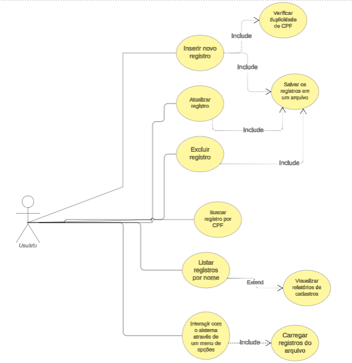
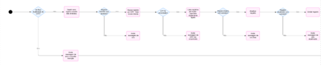
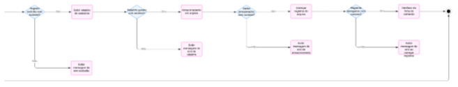

# Data Master

## ??? Grupo
Bruno Brandão
Gustavo Prado
Gabriel Henrique Vieira
Matheus Bidin

## ? Documentação

### Introdução

O DataMaster é um sistema em C para gerenciamento de registros, desenvolvido com o objetivo de aplicar conceitos avançados de estruturas de dados, como listas dinâmicas, árvores binárias e listas duplamente ligadas. Este projeto interdisciplinar do 3º semestre visa integrar teoria e prática, criando uma ferramenta funcional e didática.

O documento descreve os requisitos funcionais e não funcionais, diagramas UML, guia de usuário e tecnologias utilizadas, além de destacar os desafios enfrentados e as soluções adotadas.

### Visão do Produto

Para estudantes e desenvolvedores que têm a necessidade de aprender e implementar conceitos de estruturas de dados, o DataMaster é um sistema de cadastro que oferece armazenamento eficiente, consultas rápidas e manipulação de registros utilizando lista dinâmica, árvore binária e lista duplamente ligada. Diferentemente de outros exemplos básicos de estruturas de dados, o DataMaster tem integração de múltiplas estruturas avançadas, exemplos práticos e implementação modular em linguagem c, facilitando o aprendizado e o uso didático. 

### Requisitos Funcionais

| ID | Story Points | Prioridade | Título | Descrição                                                                                        | Critério de Aceitação                                                         |
|----|--------------|------------|--------|--------------------------------------------------------------------------------------------------|-------------------------------------------------------------------------------|
| 1  | 100          | Alta       |  Cadastrar Registro        | Como administrador, quero cadastrar um novo registro para incluí-lo no sistema. | Informar nome, CPF e idade; o sistema deve validar o CPF antes de salvar.     |
| 2  | 80           | Alta       |  Buscar Registro          | Como usuário, quero buscar um registro pelo CPF para verificar suas informações.                                                                                                   | Inserir CPF; o sistema deve retornar os dados completos.                      |
| 3  | 80           | Alta       |  Excluir Registro         | Como administrador, quero excluir um registro para manter os dados atualizados.                                                                                                   | Inserir CPF; o sistema deve remover os dados correspondentes.                 |
| 4  | 40           | Média      | Gerar Relatório  | Como administrador, quero gerar um relatório de registros ordenados por nome. | O relatório deve ser gerado em ordem alfabética. | 
| 5  | 50           | Média      |  Atualizar Registro          | Como administrador, quero atualizar os dados de um registro existente.                                                                                                 | O relatório deve ser gerado em ordem alfabética.                              |
| 6  | 80           | Alta       |  Validação de CPF         | Como usuário, quero que o sistema valide os CPFs para evitar duplicidade ou registros inválidos.                                                                                                  | Inserir CPF, editar dados específicos e confirmar alterações.                 |
| 7  | 100          | Alta       |  Persistência de Dados          | Como administrador, quero que o sistema salve os registros em arquivos para garantir persistência mesmo após o encerramento do programa.                                                                                                  | O sistema deve verificar a unicidade e formato válido do CPF antes de salvar. |
| 8  | 40           | Média      |  Interface Intuitiva          | Como usuário, quero que o sistema apresente mensagens claras e menus intuitivos.                                                                                                  | Registros salvos em arquivos binários ou texto, recuperáveis ao reiniciar o programa.                                                                               |
| 9  | 90           | Alta       |  Ordenação de Registros          | Como administrador, quero que os registros sejam ordenados automaticamente para facilitar consultas e geração de relatórios.                                                                                                  |  Mensagens e menus devem orientar o usuário nas operações disponíveis.   |
| 10 | 40           | Baixa      |  Compatibilidade          | Como desenvolvedor, quero que o sistema seja compatível com diferentes sistemas operacionais (Windows, Linux, macOS) e compiladores, como GCC e MSVC.                                                                                                  | Registros na lista duplamente ligada devem permanecer em ordem alfabética após inserções ou alterações.  |

### Requisitos Não Funcionais

- Desempenho:

  - Busca por CPF em tempo O(log n) com árvore binária.

  - Inserção, busca e remoção em listas dinâmicas em O(n).

  - Relatórios gerados em O(n) com lista duplamente ligada.

- Confiabilidade: Validação de entradas e integridade dos dados.

- Persistência: Dados armazenados em arquivos locais.

- Portabilidade: Compatível com Windows, Linux e macOS.

### Diagrama de Casos de Uso

Representa as interações do administrador para cadastrar, buscar, excluir registros e gerar relatórios.

### Diagrama de Atividades

Fluxo detalhado das operações principais do sistema, incluindo:

1. Menu inicial com seleção de opções.

2. Operações disponíveis: Cadastro, Busca, Exclusão, Relatórios.

3. Decisões baseadas nos inputs do usuário.

4. O Fluxo termina no menu ou na finalização do programa.

### Modelagem de Classe

   | Classe         | Atributos                  | Operações                |
   |----------------|----------------------------|--------------------------|
   | Registro       | Nome, CPF, Telefone        | Cadastrar, Atualizar     |  
   | Lista Dinâmica | Ponteiro para início / Fim | Inserir, Remover, Buscar | 
   | Árvore Binária | Ponteiro para Raíz         | Inserir, Remover, Buscar | 

### Guia do usuário

Instruções Passo a Passo:

    1. Cadastrar Registro:
        - Escolha "Cadastrar"
        - Insira os dados solicitados(nome, CPF, idade)
    2. Buscar Registro:
        - Insira o CPF para consulta
    3. Excluir Registro:
        - Insira o CPF do registro a ser removido.
    4. Gerar Relatório:
        - O sistema exibe a lista ordenada ou salva o arquivo.

Tecnologias Utilizadas

    - Linguagem: C((Padrão C11 ou posterior).
    - Compiladores: GCC (Linux) e MSVC (Windows).
    - Ferramentas: CLion, Linux Terminal. 

Problemas e Soluções:

    1. Integração de Estruturas:
        - Desafio: Conectar lista dinâmica, árvore binária e lista duplamente ligada.
        - Solução: Modularização e testes incrementais.
    2. Persistência de Dados:
        - Desafio: Armazenar e recuperar grandes volumes de dados. 
        - Solução: Uso de arquivos binários para maior eficiência.

### Conclusão

O desenvolvimento do DataMaster possibilitou aplicar estruturas de dados avançadas e explorar conceitos fundamentais como modularidade e escalabilidade. Futuras melhorias podem incluir uma interface gráfica e integração com banco de dados para maior robustez. 

                                                                           

